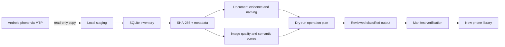

# Mobile Library Automation

Local, privacy-first automation for cleaning a noisy phone library and organizing a personal document archive.

This project started after a phone migration exposed two problems at once: thousands of random images and WhatsApp memes were mixed with useful photos, while years of text documents had accumulated under opaque or duplicated filenames. The goal was to build an auditable pipeline that could inventory, classify, deduplicate, rename and verify the collection without uploading personal content to a cloud service.

> Portfolio repository: the original private data, manifests, hashes, face embeddings and device identifiers are intentionally excluded. The public code demonstrates the reusable and safety-critical parts of the workflow with synthetic configuration.

## Authorship and working method

This is an openly AI-assisted project. The project owner identified the real-world problem, explained the desired outcome, defined the privacy and safety constraints, reviewed the results and asked that the work use as few model tokens as practical. Codex, an AI coding agent, produced the implementation and documentation under that direction.

The repository therefore demonstrates problem framing, clear delegation to an AI system, constraint setting, iterative validation and responsible delivery. It does not claim that the project owner personally designed or wrote every line of code.

[Read this page in Spanish](README.es.md)

## Results from the real run

| Area | Result |
| --- | ---: |
| Files copied from the phone staging area | 17,569 |
| Images inventoried and processed | 14,664 |
| Images selected for the clean phone library | 954 |
| Exact duplicate copies isolated with SHA-256 | 42 |
| Documents inventoried and classified | 315 |
| Documents meaningfully renamed or normalized | 179 |
| Processing coverage | 100% |

Processing coverage means that every inventoried item received a result. It is not a claim of 100% classification accuracy; zero-shot scores require human evaluation on a labelled sample.

## What it demonstrates

- End-to-end automation across Windows MTP, Python and PowerShell.
- Incremental inventory in SQLite so unchanged files are not recomputed.
- Exact duplicate detection with SHA-256; visual similarity never authorizes deletion.
- Configurable semantic classification with OpenCLIP and optional local computer-vision features.
- Collision-safe document naming based on extracted metadata and text evidence.
- Dry-run plans, audit manifests, backups, verification and rollback-oriented design.
- Local-only processing for private documents and images.
- Efficient human-AI collaboration under an explicit token-minimization constraint.

## Architecture



## Public repository scope

The reusable public implementation includes:

- recursive inventory and SQLite persistence;
- streaming SHA-256 and exact-duplicate grouping;
- PDF, DOCX, XLSX and text evidence extraction;
- configurable keyword-based document categories;
- optional OpenCLIP image scoring from configurable prompts;
- a safe MTP copy script that never deletes phone content;
- tests for hashing, naming collisions, path traversal and incremental inventory.

The one-off destructive phone-cleanup scripts are not published. The production run used closed manifests and explicit confirmation, but deletion logic is deliberately outside this portfolio repository.

## Quick start

Requirements: Python 3.11+; Windows is required only for the MTP helper.

```bash
python -m venv .venv
python -m pip install -e .
mobile-library scan ./sample-data --db ./run/library.sqlite
mobile-library plan-documents ./sample-data/documents --config config.example.toml --output ./run/document-plan.json
mobile-library verify-plan ./sample-data/documents ./run/document-plan.json
python -m unittest discover -s tests -v
```

Add the optional local vision stack with:

```bash
python -m pip install -e ".[ml]"
mobile-library score-photos ./photos --config config.example.toml --output ./run/photo-scores.json
```

The first OpenCLIP run downloads model weights. Image content remains local.

## Safety model

1. Copy from MTP into local staging; do not classify against the live phone.
2. Inventory and hash before planning any mutation.
3. Default every operation to dry-run.
4. Reject paths that escape the declared source root.
5. Treat only identical SHA-256 values as deletable duplicates.
6. Preserve a manifest and verify counts after every stage.

See [Privacy and publication boundaries](docs/PRIVACY.md) and the full [case study](docs/CASE_STUDY.md).

## Technology

Python, PowerShell, SQLite, Pillow, pypdf, OpenCLIP, PyTorch, OpenCV, YuNet, SFace, DBSCAN and Windows Shell.Application/MTP.

## License

MIT. Model weights and third-party datasets retain their own licences and are not distributed here.
